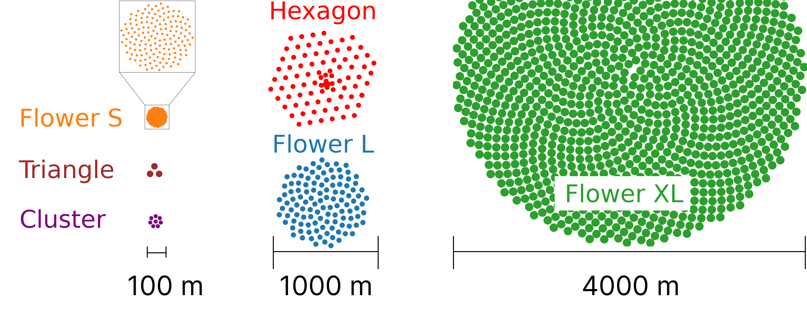
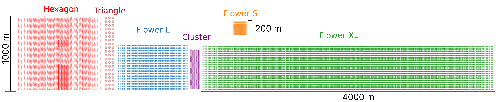

# NuBench

**Website:** [sevmag.github.io/NuBench](https://sevmag.github.io/NuBench/) — interactive leaderboard, dataset downloads, and citation info.

This repository provides access to datasets, model predictions, and model artifacts for the NuBench dataset catalogue presented in [NuBench: An Open Benchmark for Deep Learning–Based Event Reconstruction in Neutrino Telescopes](https://arxiv.org/pdf/2511.13111). Datasets are available in two formats (SQLite and Parquet) - users may choose their preferred format. 

---

---

---
The catalogue contains seven datasets simulated across six distinct detector geometries that are inspired by, but not strictly identical to, existing or proposed neutrino telescopes.

## Available Datasets
| Dataset | SQLite | Parquet | Predictions | Model Artifacts |
|---------|--------|---------|-------------|-----------------|
| Cluster | [Download](https://sid.erda.dk/share_redirect/EBamFwOU2D) | [Download](https://sid.erda.dk/share_redirect/C01vI5u9BJ) | [Download](https://sid.erda.dk/share_redirect/gZRbQvu0Ml) | [Download](https://sid.erda.dk/share_redirect/efqZPPTYBU) |
| Flower L | [Download](https://sid.erda.dk/share_redirect/EJylHQXkBr) | [Download](https://sid.erda.dk/share_redirect/HBIS5alCHj) | [Download](https://sid.erda.dk/share_redirect/E0uj9YnZVZ) | [Download](https://sid.erda.dk/share_redirect/fklOMcPIyB) |
| Flower S | [Download](https://sid.erda.dk/share_redirect/cUPqNKMRbQ) | [Download](https://sid.erda.dk/share_redirect/d08ELPHt2J) | [Download](https://sid.erda.dk/share_redirect/Ao3E9h8wLr) | [Download](https://sid.erda.dk/share_redirect/c5iAXJ5F8d) |
| Flower XL | [Download](https://sid.erda.dk/share_redirect/foVpx81yBz) | [Download](https://sid.erda.dk/share_redirect/EjHdSveUxc) | [Download](https://sid.erda.dk/share_redirect/AOjybKOo2Q) | [Download](https://sid.erda.dk/share_redirect/cR2WNVmk4l) |
| Hexagon | [Download](https://sid.erda.dk/share_redirect/GTf1gIlBbZ) | [Download](https://sid.erda.dk/share_redirect/GepbTY2MF4) | [Download](https://sid.erda.dk/share_redirect/A4hMrsbbl3) | [Download](https://sid.erda.dk/share_redirect/BLx7Z17wQe) |
| Hexagon Ice LE | [Download](https://sid.erda.dk/share_redirect/b9VHSF9X64) | [Download](https://sid.erda.dk/share_redirect/Cx2PVxHusa) | [Download](https://sid.erda.dk/share_redirect/hCIaEIm3sn) | [Download](https://sid.erda.dk/share_redirect/gckjyhPlul) |
| Triangle | [Download](https://sid.erda.dk/share_redirect/ER3B0TlPqR) | [Download](https://sid.erda.dk/share_redirect/ediHXAsygn) | [Download](https://sid.erda.dk/share_redirect/DZFXwMcQmP) | [Download](https://sid.erda.dk/share_redirect/ctNHDFuzPN) |

## File Types
- **SQLite/Parquet**: Dataset files in your preferred format. Both formats contain the same data, and are compatible with the Dataset classes in [GraphNeT](https://github.com/graphnet-team/graphnet), which you may reuse in your own experiments. We recommend the SQLite Dataset Class. Test/train partitions are defined in the selection files.
- **Predictions**: Model predictions on the test-partition of the dataset from [ParticleNet](https://github.com/graphnet-team/graphnet/blob/main/src/graphnet/models/gnn/particlenet.py), [DynEdge](https://github.com/graphnet-team/graphnet/blob/main/src/graphnet/models/gnn/dynedge.py), [GRIT](https://github.com/graphnet-team/graphnet/blob/main/src/graphnet/models/gnn/grit.py), [DeepIce](https://github.com/graphnet-team/graphnet/blob/main/src/graphnet/models/gnn/icemix.py).
- **Model Artifacts**: Trained model files and associated artifacts for reproducibility. This includes weights, pickled models and configuration files that allow you to re-create the models in [GraphNeT](https://github.com/graphnet-team/graphnet).

## Download & Extraction via Terminal
To download the files using your terminal, copy the download link from the table above and run e.g. :
`wget -P your_local_directory download_link`

All files end in `.tar.gz` but only some have been subject to compression.

Extract the contents of model artifacts and SQLite downloads using

`tar -xzf filename.tar.gz`

The contents of predictions and Parquet downloads should be extracted using

`tar -xf filename.tar.gz`

## Citation 

NuBench - https://arxiv.org/pdf/2511.13111
Prometheus - https://arxiv.org/pdf/2304.14526
GraphNeT - https://arxiv.org/abs/2501.03817
